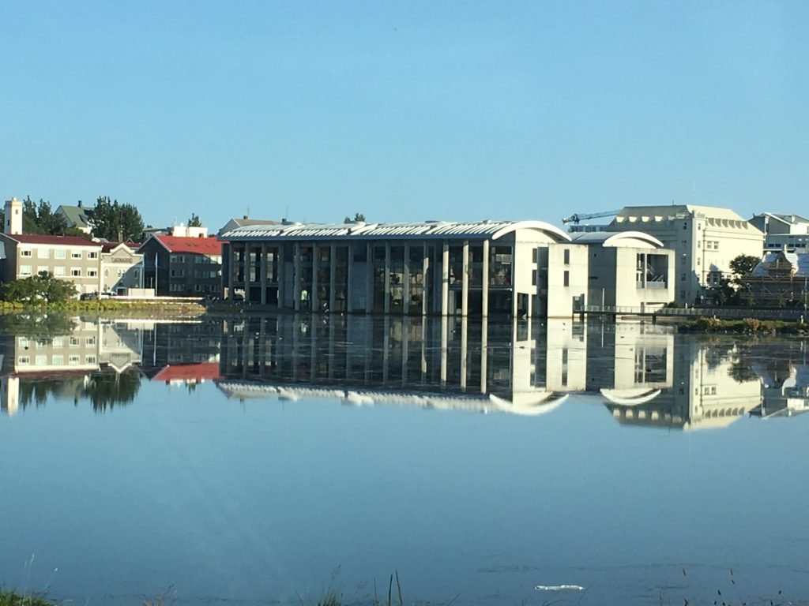

  

Svæðisbundna aðildarfélagið Píratar í Reykjavík ber meðal annars ábyrgð á framboðum í nafni Pírata á sveitarstjórnarstigi í Reykjavík og til þingkosninga.

Félagið er opið öllum sem verða 16 ára á árinu og eldri sem eru með lögheimili eða fasta búsetu í Reykjavík. Félagar í Pírötum í Reykjavík eru samhliða því sjálfkrafa félagar í móðurfélaginu, Pírötum.

## Stefnumál Pírata í Reykjavík

Stofnfundur Reykjavíkurpírata

Stjórn PíR 2018, kafteinn stjórnar er Rúnar Björn Herrera Þorkelsson. Ritari í stjórn er Þorgerður Ösp Arnþórsdóttir, meðstjórnendur eru Elsa Nore, Árni Steingrímur Sigurðsson og Guðjón Sigurbjartsson. Til vara eru: Hermann Björgvin og Þórlaug.

[Þú getur skráð þig í félagið hér](https://piratar.is/taka-thatt/hvernig-tek-eg-thatt/skraning-i-flokkinn/)

<h3>Um Pírata í Reykjavík</h3>
<ul>
<li><a href="http://www.piratar.is/taka-thatt/vidburdir/">Fundadagskrá Pírata</a></li>
<li><a href="http://www.piratar.is/category/piratar-i-reykjavik/">Fréttir um Pírata í Reykjavík</a></li>
<li><a href="http://www.piratar.is/log-pirata/log-pirata-reykjavik/">Lög félagsins</a></li>
<li><a href="http://piratar.is/fundargerdir/reykjavik/">Fundargerðir og gögn</a></li>
<li><a href="http://bambuser.com/channel/piratafundir">Netútsendingar funda</a></li>
<li><a href="https://www.facebook.com/PiratarReykjavik/">Píratar í Reykjavík á Facebook</a></li>
<li><a href="https://www.facebook.com/groups/339983356117434/?fref=ts">Umræðuhópur Pírata í Reykjavík á Facebook</a></li>
<li><a href="https://www.facebook.com/groups/143509982500002/">Sveitarstjórnarmál Pírata á FB</a></li>
<li><a href="https://x.piratar.is/polity/102/">Stefnumál Pírata í Reykjavík</a></li>
<li><strong><a href="http://piratar.is/adildarfelogin/stefnumal-pirata-reykjavik/">Stefna;Pírata í Reykjavík</a> </strong></li>
</ul>

